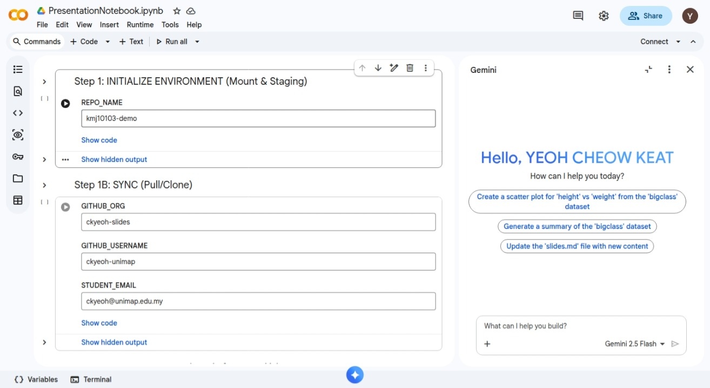
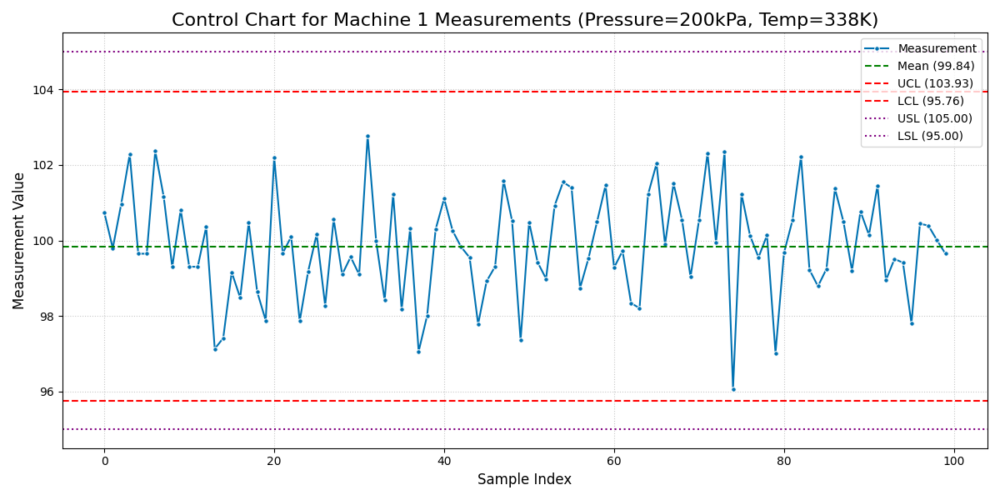
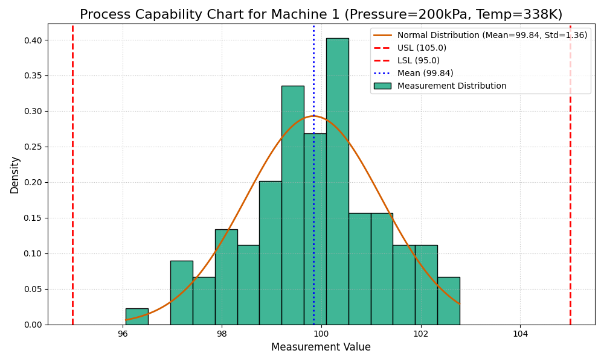
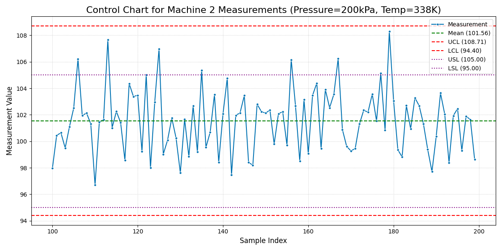
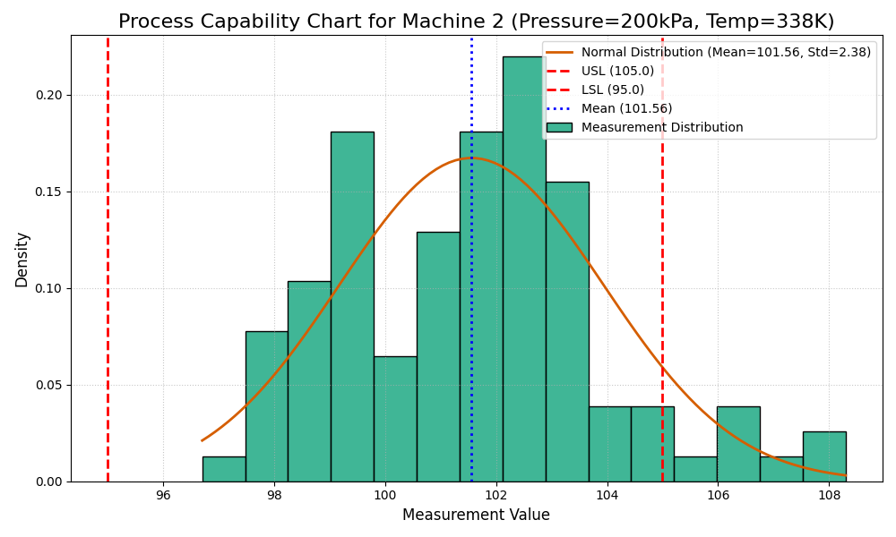
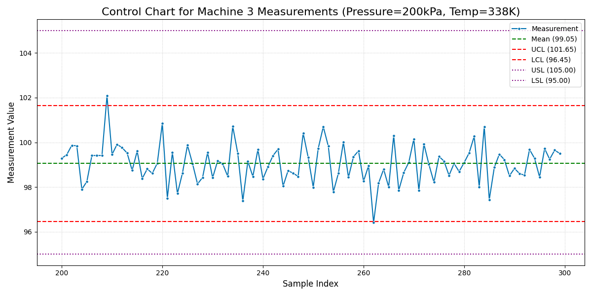
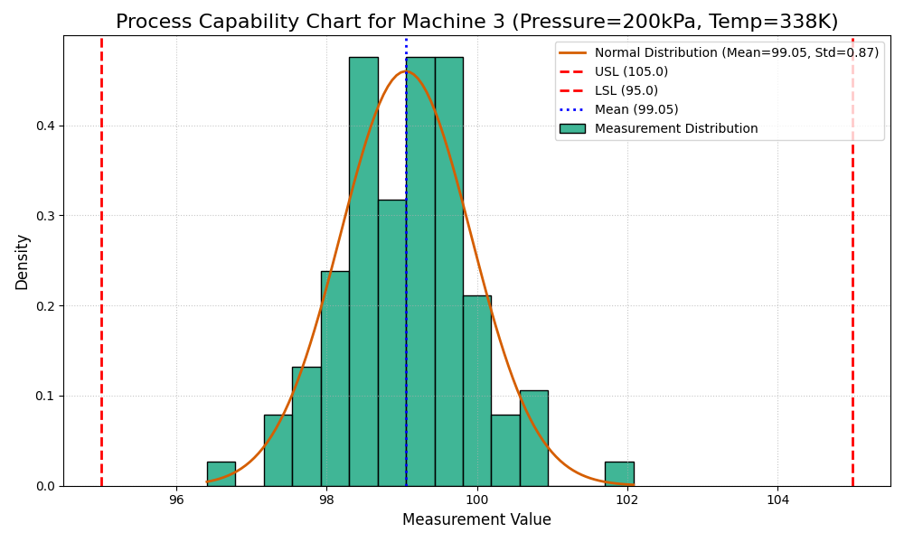

:::: {.columns}
::: {.column width="50%"}

## Sample slides
#### PlaceHolderName
#### Universiti Malaysia Perlis
#### [placeholder@email.com](mailto:placeholder@email.com)

<!-- __AUDIO_INTRO_DO_NOT_TOUCH__ -->

:::

::: {.column width="50%"}

:::

::::

---

:::: {.columns}
::: {.column width="50%"}
### Slide one
**Key Concepts:**
- Energy conservation per @carnot1824.
- $\Delta U = Q - W$
:::

::: {.column width="50%"}

:::
::::

---

<span class="slide-title" data-title="My Hidden Slide Name"></span>



---

:::: {.columns}
::: {.column width="50%"}
### The Master Equation
The fundamental relation of thermodynamics:

$$\Delta U = Q - W$$

The work done $W$ is positive when the system expands against an external pressure.
:::

::: {.column width="50%"}
<video data-src="media/videos/sample.mp4" data-autoplay loop muted width="100%"></video>
:::

::::

---

:::: {.columns}
::: {.column width="50%"}
### Visualizing the Gas Law
**Interactive Model:**

- P, V, and T relationships.
- Use the slider to adjust pressure.
- Observe the phase boundary.
:::

::: {.column width="50%"}
<iframe 
  data-src="media/plots/sample.html" 
  width="100%" 
  height="500px" 
  style="border:none;" 
  scrolling="no">
</iframe>
:::
::::

---

:::: {.columns}
::: {.column width="50%"}
#### Slide 1: Control chart for Machine 1 (Pressure = 200kPa, Temp = 338K)
:::

::: {.column width="50%"}

:::
::::

---

:::: {.columns}
::: {.column width="50%"}
#### Slide 2: Process capability chart for Machine 1 (Pressure = 200kPa, Temp = 338K)
:::

::: {.column width="50%"}

:::
::::

---

:::: {.columns}
::: {.column width="50%"}
#### Slide 3: Calculate and display the Cpk for Machine 1 (Pressure = 200kPa, Temp = 338K)

```
Cpk for Machine 1 (Pressure=200kPa, Temp=338K): 1.19
```
:::

::: {.column width="50%"}
<!-- Placeholder -->
:::
::::

---

:::: {.columns}
::: {.column width="50%"}
#### Slide 4: Text evaluation: Is Machine 1 capable under these conditions?

```
--- Capability Assessment for Machine 1 (Pressure=200kPa, Temp=338K) ---
Calculated Cpk: 1.19
Conclusion: Machine 1 is NOT capable under these conditions (Cpk < 1.33).
---------------------------------------------------------------------------
```
:::

::: {.column width="50%"}
<!-- Placeholder -->
:::
::::

---

:::: {.columns}
::: {.column width="50%"}
#### Slide 5: Control chart for Machine 2 (Pressure = 200kPa, Temp = 338K)
:::

::: {.column width="50%"}

:::
::::

---

:::: {.columns}
::: {.column width="50%"}
#### Slide 6: Process capability chart for Machine 2 (Pressure = 200kPa, Temp = 338K)
:::

::: {.column width="50%"}

:::
::::

---

:::: {.columns}
::: {.column width="50%"}
#### Slide 7: Calculate and display the Cpk for Machine 2 (Pressure = 200kPa, Temp = 338K)

```
Cpk for Machine 2 (Pressure=200kPa, Temp=338K): 0.48
```
:::

::: {.column width="50%"}
<!-- Placeholder -->
:::
::::

---

:::: {.columns}
::: {.column width="50%"}
#### Slide 8: Text evaluation: Is Machine 2 capable under these conditions?

```
--- Capability Assessment for Machine 2 (Pressure=200kPa, Temp=338K) ---
Calculated Cpk: 0.48
Conclusion: Machine 2 is NOT capable under these conditions (Cpk < 1.33).
---------------------------------------------------------------------------
```
:::

::: {.column width="50%"}
<!-- Placeholder -->
:::
::::

---

:::: {.columns}
::: {.column width="50%"}
#### Slide 9: Control chart for Machine 3 (Pressure = 200kPa, Temp = 338K)
:::

::: {.column width="50%"}

:::
::::

---

:::: {.columns}
::: {.column width="50%"}
#### Slide 10: Process capability chart for Machine 3 (Pressure = 200kPa, Temp = 338K)
:::

::: {.column width="50%"}

:::
::::

---

:::: {.columns}
::: {.column width="50%"}
#### Slide 11: Calculate and display the Cpk for Machine 3 (Pressure = 200kPa, Temp = 338K)

```
Cpk for Machine 3 (Pressure=200kPa, Temp=338K): 1.56
```
:::

::: {.column width="50%"}
<!-- Placeholder -->
:::
::::

---

:::: {.columns}
::: {.column width="50%"}
#### Slide 12: Text evaluation: Is Machine 3 capable under these conditions?

```
--- Capability Assessment for Machine 3 (Pressure=200kPa, Temp=338K) ---
Calculated Cpk: 1.56
Conclusion: Machine 3 IS capable under these conditions (Cpk >= 1.33).
---------------------------------------------------------------------------
```
:::

::: {.column width="50%"}
<!-- Placeholder -->
:::
::::

---

:::: {.columns}
::: {.column width="50%"}
#### Slide 1: Control chart for Machine 1 (Pressure = 200kPa, Temp = 338K)
:::

::: {.column width="50%"}

:::
::::

---

:::: {.columns}
::: {.column width="50%"}
#### Slide 2: Process capability chart for Machine 1 (Pressure = 200kPa, Temp = 338K)
:::

::: {.column width="50%"}

:::
::::

---

:::: {.columns}
::: {.column width="50%"}
#### Slide 3: Calculate and display the Cpk for Machine 1 (Pressure = 200kPa, Temp = 338K)

```
Cpk for Machine 1 (Pressure=200kPa, Temp=338K): 1.19
```
:::

::: {.column width="50%"}
<!-- Placeholder -->
:::
::::

---

:::: {.columns}
::: {.column width="50%"}
#### Slide 4: Text evaluation: Is Machine 1 capable under these conditions?

```
--- Capability Assessment for Machine 1 (Pressure=200kPa, Temp=338K) ---
Calculated Cpk: 1.19
Conclusion: Machine 1 is NOT capable under these conditions (Cpk < 1.33).
---------------------------------------------------------------------------
```
:::

::: {.column width="50%"}
<!-- Placeholder -->
:::
::::

---

:::: {.columns}
::: {.column width="50%"}
#### Slide 5: Control chart for Machine 2 (Pressure = 200kPa, Temp = 338K)
:::

::: {.column width="50%"}

:::
::::

---

:::: {.columns}
::: {.column width="50%"}
#### Slide 6: Process capability chart for Machine 2 (Pressure = 200kPa, Temp = 338K)
:::

::: {.column width="50%"}

:::
::::

---

:::: {.columns}
::: {.column width="50%"}
#### Slide 7: Calculate and display the Cpk for Machine 2 (Pressure = 200kPa, Temp = 338K)

```
Cpk for Machine 2 (Pressure=200kPa, Temp=338K): 0.48
```
:::

::: {.column width="50%"}
<!-- Placeholder -->
:::
::::

---

:::: {.columns}
::: {.column width="50%"}
#### Slide 8: Text evaluation: Is Machine 2 capable under these conditions?

```
--- Capability Assessment for Machine 2 (Pressure=200kPa, Temp=338K) ---
Calculated Cpk: 0.48
Conclusion: Machine 2 is NOT capable under these conditions (Cpk < 1.33).
---------------------------------------------------------------------------
```
:::

::: {.column width="50%"}
<!-- Placeholder -->
:::
::::

---

:::: {.columns}
::: {.column width="50%"}
#### Slide 9: Control chart for Machine 3 (Pressure = 200kPa, Temp = 338K)
:::

::: {.column width="50%"}

:::
::::

---

:::: {.columns}
::: {.column width="50%"}
#### Slide 10: Process capability chart for Machine 3 (Pressure = 200kPa, Temp = 338K)
:::

::: {.column width="50%"}

:::
::::

---

:::: {.columns}
::: {.column width="50%"}
#### Slide 11: Calculate and display the Cpk for Machine 3 (Pressure = 200kPa, Temp = 338K)

```
Cpk for Machine 3 (Pressure=200kPa, Temp=338K): 1.56
```
:::

::: {.column width="50%"}
<!-- Placeholder -->
:::
::::

---

:::: {.columns}
::: {.column width="50%"}
#### Slide 12: Text evaluation: Is Machine 3 capable under these conditions?

```
--- Capability Assessment for Machine 3 (Pressure=200kPa, Temp=338K) ---
Calculated Cpk: 1.56
Conclusion: Machine 3 IS capable under these conditions (Cpk >= 1.33).
---------------------------------------------------------------------------
```
:::

::: {.column width="50%"}
<!-- Placeholder -->
:::
::::
